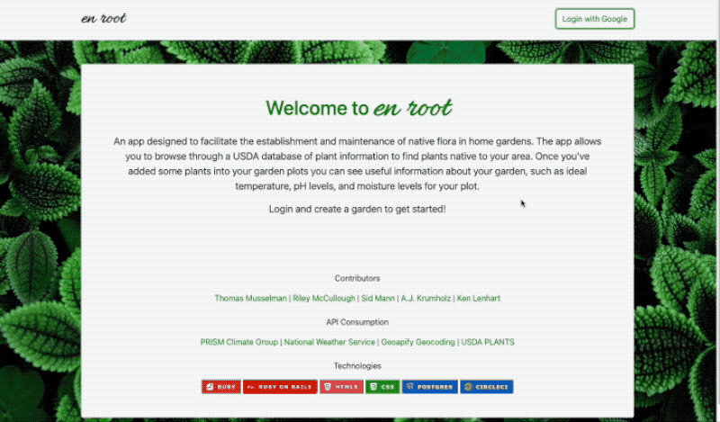

## Turing Backend Engineering Group Project

     

#### Contributors: [Thomas Musselman](https://github.com/musselmanth) | [Riley McCullough](https://github.com/Rileybmcc) | [Sid Mann](https://github.com/sjmann2) | [A.J. Krumholz](https://github.com/ajkrumholz) | [Ken Lenhart](https://github.com/penitent0)

### Links:

- [View the Project Deployed on Heroku](https://en-root.herokuapp.com/)
- [Backend GitHub Repository](https://github.com/demeter-project/demeter-be)

### Description:

En Root is a garden management app that allows users to find native plants for their location, research them, and organize them into garden plots. When a user adds plants to their virtual garden they can see useful information about their garden plots like optimal soil PH levels, shade tolerance, and plant toxicity. They can also see useful information about their garden like a seven day weather forecast.

The app uses plant data scraped from the USDA Plant Database, weather data from the OpenWeatherMap API, and USDA plant hardiness zone data provided by a public API from the Oregon State PRISM Climate Group. The data is aggregated on our back-end rails app and served up through an API to this Front-End Rails app. Additional Information about the backend service can be found on the backend GitHub repository linked above.

### Project Learning Goals

This project was accomplished as part of the Curriculum for the Turing School of Software and Design, and was completed over a two week sprint. Some of the learning goals for this project were:

- Completing a full web application from start to finish, including conceptualization, project planning, testing, implementation, and deployment.
- Building a front-end and back-end application to practice the principles of Service Oriented Architechture.
- Using Project Management tools like Miro, Github Projects Board, and Figma to materialize ideas and prioritize tasks in a team environment.
- Learn to use Continuous Integration / Continuous Deployment.
- Solidify skills in consuming and creating APIs using principles of OOP.
- Learn to use OAuth for user authentication.

### Future Goals

- Consume additional plant data provide more useful information to a Gardener.
- Allow for consumption of data from sensors in a user's physical garden to provide information and action needed notifications for the garden.

### Technology Used

- Rails 5.2.6
- Ruby 2.7.4
- Google OAuth for User Authentication
- CirlceCI for CI/CD
- Heroku
- PostgreSQL Database

### Notable Features and Screenshots

Service and Facade Structure

